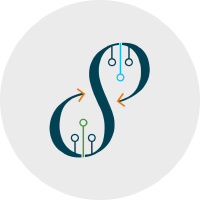
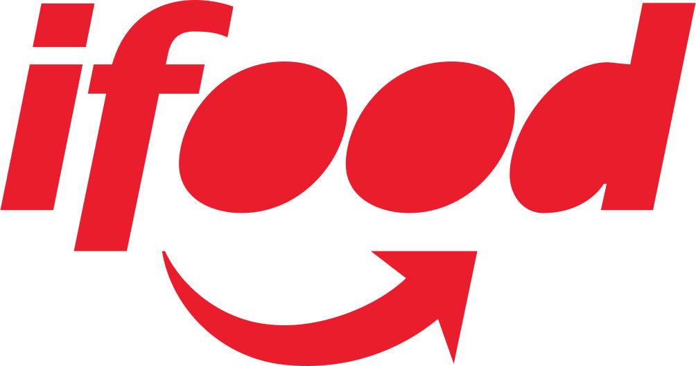

# Grafana Operator

The grafana-operator is a Kubernetes operator built to help you manage your Grafana instances in and outside of Kubernetes.

We make it possible for you to manage and share Grafana dashboards, datasources etc. through code between multiple instances in an easy and scalable way.

We have also a minor homepage [https://grafana-operator.github.io/grafana-operator/]([https://grafana-operator.github.io/grafana-operator/]).

This is our 5th version of the operator, version 5 resides in the master branch.
Version 4 is currently actively supported with the possibility of adding new **minor** features.
This will disappear as soon as we release 5.0.0, when this happens we will only accept bug fixes for version 4.
To perform version 4 specific changes please look at the v4 branch.

## Companies and teams that trust and use the Grafana operator

| Company  | Logo | Company | Logo
| :---     |    :----:   | :---        |    :----:   |
| [Red Hat](https://www.redhat.com)|  | [Integreatly](https://www.redhat.com/en/products/integration)| |
 [Continental](https://www.continental.com/)| | [Handelsbanken]("https://www.handelsbanken.se/en/")||
| [Xenit](https://xenit.se/contact/)|| [Torqata](https://torqata.com)| |
|[Operate-first](https://www.operate-first.cloud/)| | [iFood](https://www.ifood.com.br)| |

***If you find this operator useful in your product/deployment, feel free to send a pull request to add your company/team to be displayed here!***

## Grafana Operator on the Kubernetes community Slack

We have set up a channel dedicated to this operator on the Kubernetes community Slack, this is an easier way to address
more immediate issues and facilitate discussion around development/bugs etc. as well as providing support for questions
about the operator.

1: Join the Kubernetes Slack (if you have not done so already) [Kubernetes Slack](https://slack.k8s.io/).

2: You will receive an email with an invitation link, follow that link and enter your desired username and password for the workspace(it might be easier if you use your Github username for our channel).

3: Once registered and able to see the Kubernetes community Slack workspace and channels follow this link to the [grafana-operator channel](https://kubernetes.slack.com/messages/grafana-operator/ ).

Alternatively:
If you're already a member of that workspace then just follow this link to the [grafana-operator channel](https://kubernetes.slack.com/messages/grafana-operator/)
or search for "grafana-operator" in the browse channels option.

## Installation options

We support 3 deployment options.

- Helm
- Kustomize
- Openshift OLM

All releases of the operator can be found on [Operator Hub](https://operatorhub.io/operator/grafana-operator).

***Sometimes a release may take a few hours (in rare cases, days) to land on Operatorhub, please be patient, it's out of our control.***

For more information on how to install the operator please look at the [docs](docs/README.md)

## Summary of benefits

Why decide to go with the Grafana-operator over a standard standalone Grafana deployment for your monitoring stack?

If [the benefits of using an operator over standalone products as outlined by the people that created them](https://operatorframework.io/) and our current high-profile users aren't enough to convince you, here's some more:

- The ability to configure and manage your entire Grafana with the use Kubernetes resources such as CRDs, configMaps, Secrets etc.
- Automation of:
  - Ingresses.
  - Grafana product versions.
  - Grafana dashboard plugins.
  - Grafana datasources.
  - Oauth proxy.
  - many others!
- Efficient dashboard management through jsonnet, plugins and folder assignment, which can all be done through `.yamls`!
- Both Kubernetes and OpenShift supported out of the box.
- Multi-Arch builds and container images.
- Operatorhub/OLM support (Allows you to install the operator with a few clicks).
- Can deploy dashboards etc. to external grafana instances.

## Version 5

To get a more in depth overview of v5 please read our [intro blog](docs/blog/v5-intro.md)
But version 5 of the operator is a massive re-write of the operator logic, to improve:

- Performance
- Reliability
- Maintainability
- Extensibility
- Testability
- Usability

The previous versions of the operator have some serious tech-debt issues, which effectively prevent community members that aren't massively
familiar with the project and/or its codebase from contributing features that they wish to see.
These previous versions, we're built on a "as-needed" basis, meaning that whatever was the fastest way to reach the desired feature, was the way
it was implemented. This lead to situations where controllers for different resources were using massively different logic, and features were added
wherever and however they could be made to work.

The v5 version aims to re-focus the operator with a more thought out architecture and framework, that will work better, both for developers and users.
With certain standards and approaches, we can provide a better user experience through:

- Better designed Custom Resource Definitions (Upstream Grafana Native fields will be supported without having to whitelist them in the operator logic).
  - Thus, the upstream documentation can be followed to define the grafana-operator Custom Resources.
  - This also means a change in API versions for the resources, but we see this as a benefit, our previous mantra of maintaining a
    seamless upgrade from version to version, limited us in the changes we wanted to make for a long time.
- A more streamlined Grafana resource management workflow, one that will be reflected across all controllers.
- Using an upstream Grafana API client (standardizing our interactions with the Grafana API, moving away from bespoke logic).
- The use of a more up-to-date Operator-SDK version, making use of newer features.
- Implementing some proper testing.
- Cleaning and cutting down on code.
- Multi-instance AND Multi-namespace support!

## Development and Local Deployment

For more information on how to contribute to the operator look at [CONTRIBUTING.md](CONTRIBUTING.md).
