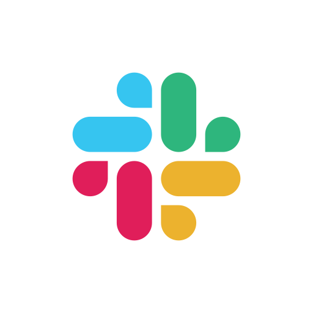

# Grafana Operator

The Grafana Operator is a Kubernetes operator built to help you manage your Grafana instances in and outside of
Kubernetes.

We make it possible for you to manage and share your grafana resources through code between multiple instances in an
easy and scalable way.

Find out more on our official website:
***[grafana.github.io/grafana-operator](https://grafana-operator.github.io/grafana-operator/).***

## Some Convincing Benefits

Why go with the Grafana-operator over a standard standalone Grafana deployment for your monitoring stack?

If [the benefits of using an operator over standalone products as outlined by the people that created them](https://operatorframework.io/)
and our current high-profile users aren't enough to convince you, here's some more:

- The ability to run a multi-namespace, multi-instance Grafana deployment without having to concern yourself with the
  overhead of managing it!
    - Management of Dashboards, Datasources, Plugins etc. through code
        - Efficient dashboard management through Jsonnet/Grafonnet, plugins and folders
    - Agnostic deployment on k8s and Openshift
        - The operator knows what environment it runs, and adjust the deployment accordingly without user interference!
    - Management of external Grafana instances
        - Run the operator for off-cluster instances and leverage the benefits of GitOps without abandoning your
          previous instances!
- Multi-Arch builds and container images.
- Operatorhub/OLM support (Allows you to install the operator with a few clicks).

## Get In Touch!

The best way to reach us is to file an issue on
***[Issues Tab](https://github.com/grafana/grafana-operator/issues)***
or click on the ***[Slack Icon](https://kubernetes.slack.com/archives/C019A1KTYKC)*** below

We're happy to help out in all grafana-operator issues, and if you're not sure, we'll point you in the right direction!

## Getting Started

All of our releases are available through

- Helm
- Kustomize
- Openshift OLM and Kubernetes ***[Operator Hub](https://operatorhub.io/operator/grafana-operator)***

Follow our ***[docs](docs/README.md)*** for more installation specific instructions

### Development And Local Deployment

For more information on how to contribute to the operator look at [CONTRIBUTING.md](CONTRIBUTING.md).

## Version Support and Development Mindset

> [!CAUTION]
> v4 will stop receiving bug fixes and security updates as of the 22nd of December 2023.
> We recommend you migrate to v5 if you haven't yet! Please follow our [v4 -> v5 Migration Guide](https://grafana.github.io/grafana-operator/blog/2023/05/27/v4-to-v5-migration/) to mitigate any potential future risks.

V5 is the current, actively developed and maintained version of the operator, which you can find on the
***[Master Branch](https://github.com/grafana/grafana-operator/tree/master)***.

A more in-depth overview of v5 is available in the [intro blog](docs/blog/v5-intro.md)

V5 is a ground-up rewrite of the operator to refocus development on:

- Performance
- Reliability
- Maintainability
- Extensibility
- Testability
- Usability

The previous versions of the operator have some serious tech-debt issues, which effectively prevent community members
that aren't massively
familiar with the project and/or its codebase from contributing features that they wish to see.

These previous versions, we're built on a "as-needed" basis, meaning that whatever was the fastest way to reach the
desired feature, was the way
it was implemented. This lead to situations where controllers for different resources were using massively different
logic, and features were added
wherever and however they could be made to work.

V5 aims to re-focus the operator with a more thought out architecture and framework, that will work better,
both for developers and users.
With certain standards and approaches, we can provide a better user experience through:

- Better designed Custom Resource Definitions (Upstream Grafana Native fields will be supported without having to
  whitelist them in the operator logic).
    - Upstream documentation can be followed to define the Grafana Operator Custom Resources.
    - This also means a change in API versions for the resources, but we see this as a benefit, our previous mantra of
      maintaining a seamless upgrade from version to version, limited us in the changes we wanted to make for a long
      time.
- A more streamlined Grafana resource management workflow, one that will be reflected across all controllers.
- Using an upstream Grafana API client (standardizing our interactions with the Grafana API, moving away from bespoke
  logic).
- The use of a more up-to-date Operator-SDK version, making use of newer features.
    - along with all relevant dependencies being kept up-to-date.
- Proper testing.
- Cleaning and cutting down on code.
- Multi-instance and Multi-namespace support!
