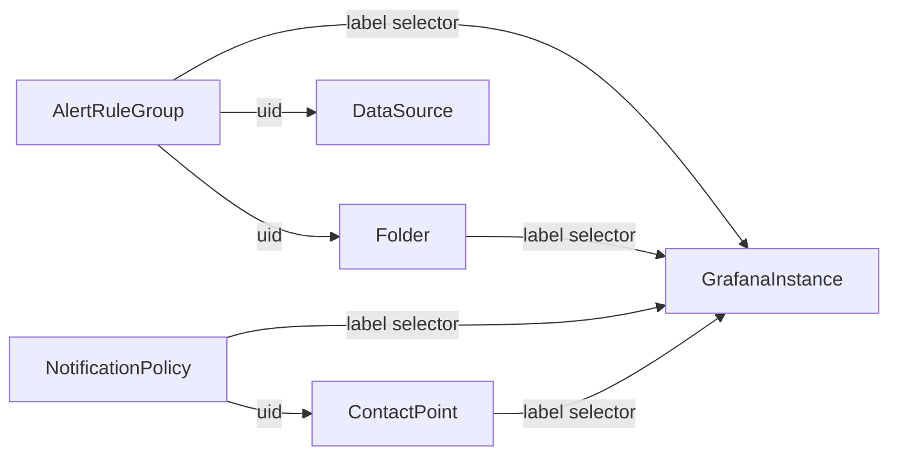

## Summary

Introduce support for Grafana Alerting (requires Grafana > 9).

This document contains the complete design required to support configuring Alerts with Grafana Operator.

## Info

status: Decided


## Motivation

With legacy alerting replaced by unfied alerting, users want a way to configure their alerts alongside the rest of their application manifests.

Currently this is only possible via Terraform. This feature would enable more users to switch to Grafana alerting.

## Proposal

This document proposes extending the CRDs to support Alert Rules, Contact Points and Notificaton Policies.

To realise this, one of several paths can be taken.

### Option 1: Create new CRDs for every resource.

This option is based on the [terraform provisioner](https://grafana.com/docs/grafana/v10.2/alerting/set-up/provision-alerting-resources/terraform-provisioning). It results in the following new custom resources:

* `AlertRuleGroup`: Group of alert rules with a common evaluation interval. Needs to be linked to a folder
* `ContactPoint`: YAML representation of a contact point
* `NotificationPolicy`: YAML representation of a notification policy


Everything needs a label selector to decide to which grafana instance this applies to and cross-references are made using UIDs.




Alerts and the Notification Policy don't need to reference each other as alerts
are fired with a set of labels (not k8s-labels) which get matched by the policy.


| Pro                                      | Contra                                                                   |
|------------------------------------------|--------------------------------------------------------------------------|
| Simple and straighforward to implement   | Lots of repetition to link multiple resources                            |
| Granular permission management for users | NotificationPolicy is a singleton object, no clean way to represent this |

#### Example CRs

```yaml
---
apiVersion: grafana.integreatly.org/v1beta1
kind: GrafanaAlertRuleGroup
metadata:
  name: test-alert-folder
spec:
  instanceSelector:
    matchLabels:
      dashboards: "grafana"
  folderUID: some-test-folder
  groups:
    group_one:
      interval: 5m
      rules:
        - for: 5m
          grafana_alert:
            # ...
---
apiVersion: grafana.integreatly.org/v1beta1
kind: ContactPoint
metadata:
  name: send-to-slack # will be used as UID
spec:
  instanceSelector:
    matchLabels:
      dashboards: "grafana"
  title: Send to slack channel
  slack:
    url: 'https://...'
    text: |
      {{ len .Alerts.Firing }} alerts are firing!

      Alert summaries:
      {{ range .Alerts.Firing }}
      {{ template "Alert Instance Template" . }}
      {{ end }}
    |
---
apiVersion: grafana.integreatly.org/v1beta1
kind: NotificationPolicy
metadata:
  name: example-policy
spec:
  instanceSelector:
    matchLabels:
      dashboards: "grafana"
  groupBy:  ["alertname"]
  contactPoint: 'send-to-slack'
  groupWait: "45s"
  groupInterval: "6m"
  repeatInterval: "3h"
  policy:
    groupBy: ["..."]
    matcher:
      label: a
      match: =
      value: b
    contactPoint: 'send-to-oncall'
    policy:
      groupBy: ["..."]
      matcher:
        label: sublabel
        match: =
        value: subvalue
      contactPoint: 'send-to-email'
```

### Option 2: Extend existing CRDs where possible

As some resources only make sense in the context of another one (e.g AlertFolder needs an existing folder), we can extend the CRDs of the existing types with new alerting specific information.

This would result in:
- `GrafanaFolder` having a new section for `alerting`
- `Grafana` having new sections for notification policies and contact points

| Pro                           | Contra                                                                                                                |
|-------------------------------|-----------------------------------------------------------------------------------------------------------------------|
| No new CRDs                   | Loss of granularity (What if one team wants to own their contact-point without having access to the Grafana resource?) |
| Easy to check for correctness |                                                                                                                       |

#### Example CRDs:

```yaml
apiVersion: grafana.integreatly.org/v1beta1
kind: Grafana
metadata:
  name: grafana
  labels:
    dashboards: "grafana"
spec:
  config:
    # ...
  contactPoints:
  - title: Send to slack channel
    slack:
      url: 'https://...'
      text: |
        {{ len .Alerts.Firing }} alerts are firing!

        Alert summaries:
        {{ range .Alerts.Firing }}
        {{ template "Alert Instance Template" . }}
        {{ end }}
      |

  notificationPolicy:
    groupBy:  ["alertname"]
    contactPoint: 'send-to-slack'
    groupWait: "45s"
    groupInterval: "6m"
    repeatInterval: "3h"
    policy:
      groupBy: ["..."]
      matcher:
        label: a
        match: =
        value: b
      contactPoint: 'send-to-oncall'
      policy:
        groupBy: ["..."]
        matcher:
          label: sublabel
          match: =
          value: subvalue
        contactPoint: 'send-to-email'
---
apiVersion: grafana.integreatly.org/v1beta1
kind: GrafanaFolder
metadata:
  name: test-folder
spec:
  instanceSelector:
    matchLabels:
      dashboards: "grafana"
  title: custom title
  alertGroups:
    group_one:
      interval: 5m
      rules:
        - for: 5m
          grafana_alert:
            # ...
```

### Option 3: Hybrid

Merging both approaches where appropriate is also an option. Further details need to be discussed for this to be viable.

## Decision Outcome

The maintianrs have decided to use _Option 1_ to keep Alerting separated from other resources and keep the existing APIs as simple as possible. Implementation will be tracked in upcoming PRs and issues and linked in this document.
## Related discussions

- [Issue 911](https://github.com/grafana/grafana-operator/issues/911)
- [PR 1144](https://github.com/grafana/grafana-operator/pull/1144)

