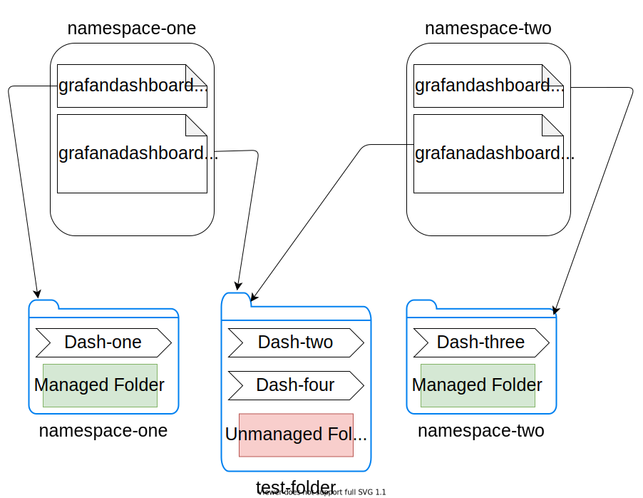

# Working with dashboards

This document describes how to create dashboards and manage plugins (panels).

## Dashboard properties

Dashboards are represented by the `GrafanaDashboard` custom resource. Examples can be found
in `deploy/examples/dashboards`.

The following properties are accepted in the `spec`:

* *json*: Raw json string with the dashboard contents. Check
  the [official documentation](https://grafana.com/docs/reference/dashboard/#dashboard-json).
* *jsonnet*: Jsonnet source. The [Grafonnet](https://grafana.github.io/grafonnet-lib/) library is made available
  automatically and can be imported.
* *url*: Url address to download a json or jsonnet string with the dashboard contents.
    * ***Warning***: Ensure that the json field is empty if setting the URL, if both url and json are specified then the
      json field won't be updated with fetched.
* *plugins*: A list of plugins required by the dashboard. They will be installed by the operator if not already present.
* *datasources*: A list of datasources to be used as inputs. See [datasource inputs](#datasource-inputs).
* *configMapRef*: Import dashboards from config maps. See [config map refreences](#config-map-references).
* *customFolderName*: Assign this dashboard to a custom folder, if no folder with this name exists on the instance, then
  a new one will be created.
    * _Note_: Folders with custom names are not managed by the operator, by purposeful design they won't be deleted when
      empty, deletion for these requires manual intervention.

## Creating a new dashboard

By default, the operator only watches for dashboards in it's own namespace. To watch for dashboards in other namespaces,
the `--scan-all` flag must be passed.

To create a dashboard in the `grafana` namespace run:

```sh
$ kubectl create -f deploy/examples/dashboards/SimpleDashboard.yaml -n grafana
```

## Dashboard UIDs

Grafana allows users to define the UIDs of dashboards. If an uid is present on a dashbaord, the operator will use it and
not assign a generated one. This is often used to guarantee predictable dashboard URLs for interlinking.

## Dashboard error handling

If the dashboard contains invalid JSON a message with the parser error will be added to the status field of the
dashboard resource.

## Plugins

Dashboards can specify plugins they depend on. The operator will automatically install them.

You need to provide a name and a version for every plugin, e.g.:

```yaml
spec:
  name: "dummy"
  json: "{}"
  plugins:
    - name: "grafana-piechart-panel"
      version: "1.3.6"
    - name: "grafana-clock-panel"
      version: "1.0.2"
```

see [plugins](./plugins.md) for more information.

Plugins are installed from the [Grafana plugin registry](https://grafana.com/plugins).

## Dashboard discovery

The operator uses a list
of [set based selectors](https://kubernetes.io/docs/concepts/overview/working-with-objects/labels/#resources-that-support-set-based-requirements)
to discover dashboards by their [labels](https://kubernetes.io/docs/concepts/overview/working-with-objects/labels/).
The `dashboardLabelSelector` property of the `Grafana` resource allows you to add selectors by which the dashboards will
be filtered.

*NOTE*: If no `dashboardLabelSelector` is present, the operator will not discover any dashboards. The same goes for
dashboards without labels, they will not be discovered by the operator.

Every selector can have a list of `matchLabels` and `matchExpressions`. The rules inside a single selector will be **
AND**ed, while the list of selectors is evaluated with **OR**.

For example, the following selector:

```yaml
dashboardLabelSelector:
  - matchExpressions:
      - { key: app, operator: In, values: [ grafana ] }
      - { key: group, operator: In, values: [ grafana ] }
```

requires the dashboard to have two labels, `app` and `group` and each label is required to have a value of `grafana`.

To accept either, the `app` or the `group` label, you can write the selector in the following way:

```yaml
dashboardLabelSelector:
  - matchExpressions:
      - { key: app, operator: In, values: [ grafana ] }
  - matchExpressions:
      - { key: group, operator: In, values: [ grafana ] }          
```

## Discovering dashboards in other namespaces

The operator can discover dashboards in other namespaces if either the `--scan-all` flag is set or a list of watch
namespaces is provided using the `--namespaces` flag. However this requires cluster wide permissions to
the `GrafanaDashboard` custom resource. Create the permissions with:

```sh
$ oc create -f deploy/cluster_roles
```

*NOTE*: when installing the operator from [operatorhub](https://operatorhub.io/) it will only have permissions to the
namespace it's installed in. To discover dashboards in other namespaces you need to apply the cluster roles after
installing the operator and add the `--scan-all` flag to the operator container.

## Datasource inputs

Dashboards may rely on certain datasources to be present. When a dashboard is exported, Grafana will populate
an `__inputs` array with required datasources. When importing such a dashboard, the required datasources have to be
mapped to datasources existing in the Grafana instance. For example, consider the following dashboard:

```json
{
  "__inputs": [
    {
      "name": "DS_PROMETHEUS",
      "label": "Prometheus",
      "description": "",
      "type": "datasource",
      "pluginId": "prometheus",
      "pluginName": "Prometheus"
    }
  ],
  "title": ...
  "panels": ...
}
```

A Prometheus datasource is expected and will be referred to as `DS_PROMETHEUS` in the dashboard. To map this to an
existing datasource with the name `Prometheus`, add the following `datasources` section to the dashboard:

```yaml
...
spec:
  datasources:
    - inputName: "DS_PROMETHEUS"
      datasourceName: "Prometheus"
...
```

This will allow the operator to replace all occurrences of the datasource variable `DS_PROMETHEUS` with the actual name
of the datasource. An example for this is `dashboards/KeycloakDashboard.yaml`.

## Config map references

The json contents of a dashboard can be defined in a config map with the dashboard CR pointing to that config map.

```yaml
...
spec:
  name: grafana-dashboard-from-config-map.json
  configMapRef:
    name: <config map name>
    key: <key of the entry containing the json contents>
...
```

## Dashboard Folder Support

Due to the fact that the operator now supports the discovery of cluster-wide dashboards.

### Managed folders

By default if no `CustomFolderName` Spec field value is defined in the yaml of the dashboard (or if the CustomFolderName
field is an empty string `""`) then the dashboard will be assigned to the namespaced-named folder matching the namespace
into which the dashboard was deployed, i.e if deployed to `test-ns` then a new folder (if one with that name doesn't
exist already) will be created and named `test-ns` and the dashboard assigned to it.

Default assignment of the dashboards to namespace-named folders is consider as a _managed folder_, this means that when
a managed folder has no dashboards assigned to it, it will be deleted to clean up the UI.

### Unmanaged folders

When defining `customFolderName` in a dashboard, the resulting folder will be named as the string in this field
specifies, this is considered as an _unmanaged folder_ and won't be deleted even if empty and will remain on the UI.
Custom folders can have multiple dashboards assigned to them.

_Note_ : Deletion of unmanaged folders requires manual intervention.



### Moving dashboards between managed & unmanaged folders

To move a dashboard between managed and unmanaged folders, simply remove or add the `CustomFolderName` field value from
the dashboard spec, this will update the hash of the dashboard on the next reconcile loop, and re-add the dashboard to
the desired folder.
 
