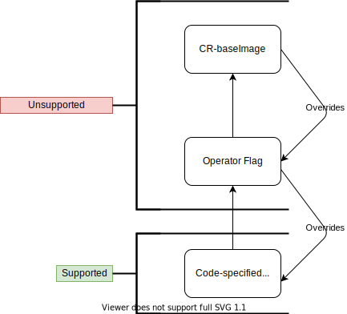

# Deploying a Grafana instance

This document describes how to get up and running with a new Grafana instance on Kubernetes.

## Deploying the operator

The first step is to install the Grafana operator to a namespace in your cluster.

There are two options for this procedure, automated via Ansible, or manually running kubectl/oc commands.

### Deploy an example grafana instance and operator

Run `make operator/deploy` To deploy the latest released image of the operator, This uses the default operator.yaml and
Grafana.yaml resources found in the `deploy` directories and subdirectories.

***Warning:*** The following make recipe uses the latest master Image. It should only be used for testing, for
production please use the tagged releases.

Run `make operator/deploy/master` to deploy the image from the master branch of the operator.

### Automated Procedure

Cluster admin install cluster resources. For more details and additional parameters
see [grafana-operator-cluster-resources.yaml](../deploy/ansible/README.md#grafana-operator-cluster-resourcesyaml).

```sh
ansible-playbook deploy/ansible/grafana-operator-cluster-resources.yaml \
  -e k8s_host=https://ocp.example.xyz \
  -e k8s_username=admin1 \
  -e k8s_password=secret \
  -e grafana_operator_namespace=grafana
```

Optional: If `grafana_operator_args_scan_all` is set to `true` for the `grafana-operator-namespace-resources.yaml`
playbook then Cluster Admin needs to run this playbook to allow operator to scan all namespaces for dashboards For more
details and additional parameters
see [grafana-operator-cluster-dashboards-scan.yaml](../deploy/ansible/README.md#grafana-operator-cluster-dashboards-scanyaml)
.

```sh
ansible-playbook deploy/ansible/grafana-operator-cluster-dashboards-scan.yaml \
  -e k8s_host=https://ocp.example.xyz \
  -e k8s_username=admin1 \
  -e k8s_password=secret \
  -e grafana_operator_namespace=grafana
```

Self provisioner install operator For more details and additional parameters
see [grafana-operator-namespace-resources.yaml](../deploy/ansible/README.md#grafana-operator-namespace-resourcesyaml).

```sh
ansible-playbook deploy/ansible/grafana-operator-namespace-resources.yaml \
  -e k8s_host=https://ocp.example.xyz \
  -e k8s_username=project_creator \
  -e k8s_password=secret \
  -e grafana_operator_namespace=grafana
```

### Minikube deployment

Follow this documentation [Deploying the Grafana operator in minikube](./minikube.md)

### Manual Procedure

To create a namespace named `grafana` run:

```sh
$ kubectl create namespace grafana
```

Create the custom resource definitions that the operator uses:

```sh
$ kubectl create -f deploy/crds
```

Create the operator roles:

```sh
$ kubectl create -f deploy/roles -n grafana
```

If you want to scan for dashboards in other namespaces you also need the cluster roles:

```sh
$ kubectl create -f deploy/cluster_roles
```

To deploy the operator to that namespace you can use `deploy/operator.yaml`:

```sh
$ kubectl create -f deploy/operator.yaml -n grafana
```

Check the status of the operator pod:

```sh
$ kubectl get pods -n grafana
NAME                                READY     STATUS    RESTARTS   AGE
grafana-operator-78cfcbf8db-ssrgq   1/1       Running   0          17s
```

## Grafana image Support Chart

Please take note of this chart when wanting to deploy custom grafana images through either `--grafana-image` operator
flags or `baseImage` CR spec fields.

This chart shows how the operator prioritises which image will be used for the deployment, and the versions that it's
known to support. Only the grafana image specified in
code [here](https://github.com/integr8ly/grafana-operator/blob/master/pkg/controller/model/constants.go#L5) will be
supported in unit/e2e tests and as part of the operator, any other specified grafana image through these options may not
work as expected.



## Operator flags

The operator accepts a number of flags that can be passed in the `args` section of the container in the deployment:

* `--grafana-image`: overrides the Grafana image, defaults to `docker.io/grafana/grafana` on grafanas official dockerhub, the
  version of which can be
  found [here](https://github.com/integr8ly/grafana-operator/blob/master/pkg/controller/model/constants.go#L4-L5).

* `--grafana-image-tag`: overrides the Grafana tag. See `controller_config.go` for default.

* `--grafana-plugins-init-container-image`: overrides the Grafana Plugins Init Container image, defaults
  to `quay.io/integreatly/grafana_plugins_init`.

* `--grafana-plugins-init-container-tag`: overrides the Grafana Plugins Init Container tag, defaults to `0.0.3`.

* `--grafonnet-location`: overrides the location of the grafonnet library. Defaults to `/opt/grafonnet-lib`. Only useful
  when running the operator locally.

* `--scan-all`: watch for dashboards in all namespaces. This requires the operator service account to have cluster wide
  permissions to `get`, `list`, `update` and `watch` dashboards. See `deploy/cluster_roles`.

* `--namespaces`: watch for dashboards in a list of namespaces. Mutually exclusive with `--scan-all`.

* `--zap-level=n`: set the logging level for the operator, leaving out this flag will only log Errors and error related
  info, current options are:
    - `--zap-level=1`: show all Info level logs

See `deploy/operator.yaml` for an example.

If using the automated Ansible installer see
the [grafana-operator-namespace-resources.yaml - Parameters](../deploy/ansible/README.md#parameters-1) for the
equivalent parameters.

## Deploying Grafana

Create a custom resource of type `Grafana`, or use the one in `deploy/examples/Grafana.yaml`.

The resource accepts the following properties in it's `spec`:

* ***baseImage***: Specifies a custom grafana image for this deployment.
    - ***Warning!*** this overwrites the `--grafana-image` Operator flag, please refer to the grafana image support
      chart.

* ***initImage***: Specifies a custom grafana plugins init image for this deployment.
    - ***Warning!*** this overwrites the `--grafana-plugins-init-container-image` Operator flag, please refer to the
      grafana image support chart.

* ***dashboardLabelSelector***: A list of either `matchLabels` or `matchExpressions` to filter the dashboards before
  importing them.

* ***containers***: Extra containers to be added to the Grafana deployment. Can be used for example to add auth proxy
  side cars.

* ***secrets***: A list of secrets that are added as volumes to the deployment. Useful in combination with
  extra `containers` or when extra configuraton files are required.

* ***configMaps***: A list of config maps that are added as volumes to the deployment. Useful in combination with
  extra `containers` or when extra configuraton files are required.

* ***config***: The properties used to generate `grafana.ini`. All properties defined in
  the [official documentation](https://grafana.com/docs/installation/configuration/) are supported although some of them
  are not allowed to be overridden (path configuration). See `deploy/examples/Grafana.yaml` for an example.

* ***ingress***: Allows configuring the Ingress / Route resource (see [here](#configuring-the-ingress-or-route)).

* ***service***: Allows configuring the Service resource (see [here](#configuring-the-service)).

* ***serviceAccount***: Allows configuring the Service account (see [here](#configuring-the-serviceaccount)).

* ***deployment***: Allows configuring the deployment (see [here](#configuring-the-deployment)).

* ***resources***: Allows configuring the requests and limits for the Grafana pod (
  see [here](https://kubernetes.io/docs/reference/generated/kubernetes-api/v1.16/#resourcerequirements-v1-core)).

* ***client***: Grafana client options (see [here](#configuring-grafana-api-access)).

* ***jsonnet***: Label selector for jsonnet libraries (see [here](#jsonnet-library-discovery)).
* ***livenessProbeSpec***: Defines the time, in seconds, to be used for each field in the readiness probe
  configuration  ( see [here](#configuring-readinessliveness-probes))
* ***readinessProbeSpec***: Defines the time, in seconds, to be used for each field in the readiness probe
  configuration ( see [here](#configuring-readinessliveness-probes))

*NOTE*: by default no Ingress or Route is created. It can be enabled with `spec.ingress.enabled`.

To create a new Grafana instance in the `grafana` namespace, run:

```sh
$ kubectl create -f deploy/examples/Grafana.yaml -n grafana
```

Get the URL of the instance and open it in a browser:

```sh
$ kubectl get ingress -n grafana
NAME              HOSTS                           ADDRESS   PORTS     AGE
grafana-ingress   grafana.apps.127.0.0.1.nip.io             80        28s
```

## Config reconciliation

When the config object in the `Grafana` CR is modified, the `grafana.ini` will be automatically updated and Grafana will
be restarted.

## Configuring the Ingress or Route

By default the operator will not create an Ingress or Route. This can be enabled via `spec.ingress` in the `Grafana` CR.
The operator will create a Route when running on OpenShift, otherwise an Ingress. Various other properties can also be
configured:

```yaml
spec:
  ingress:
    enabled: <Boolean>     # Create an Ingress (or Route if on OpenShift)
    ingressClassName: <String> # Sets ingress ingressClassName
    hostname: <String>      # Sets the hostname. Assigned automatically on OpenShift if not provided
    tlsEnabled: <Boolean>   # Enable TLS on Ingress
    tlsSecretName: <String> # TLS secret name in the same namespace
    targetPort: <String>    # Which port to target on the service
    termination: <String>   # TLS termination type (defaults to edge, other options are reencrypt or passthrough)
    labels: # Additional labels for the Ingress or Route
      app: grafana
      ...
    annotations: # Additional annotations for the Ingress or Route
      app: grafana
      ...
    path:                   # Sets the path of the Ingress. Ignored for Routes
    pathType: <String>      # Sets pathType: ImplementationSpecific, Exact, Prefix (defaults to ImplementationSpecific)
```

## Configuring the ServiceAccount

```yaml
spec:
  serviceAccount:
    type: object
    properties:
      skip:
        type: boolean
        description: setting this to `True` will stop the operator from reconciling the `grafana-serviceaccount`
          serviceaccount, Leaving this field empty is equivalent to setting it to`False`
      annotations:
        type: object
        description: Additional annotations for the serviceaccount
      labels:
        type: object
        description: Additional labels for the serviceaccount
```

## Configuring the Service

Various properties of the Service can be configured:

```yaml
spec:
  service:
    name: # Configurable name for the grafana-service
    labels: # Additional labels for the Service
      app: grafana
      ...
    annotations: # Additional annotations for the Service
      app: grafana
      ...
    type: NodePort          # Set Service type, either NodePort, ClusterIP or LoadBalancer
    ports: # Additional ports to add to the service
      - name: grafana-proxy
        port: 9091
        protocol: TCP
        targetPort: ...

```

NOTE: Service name must adhere to a DNS-1035 label which must consist of lower case alphanumeric characters or '-',
start with an alphabetic character, and end with an alphanumeric character (e.g. 'my-name', or 'abc-123', regex used for
validation is `'[a-z]([-a-z0-9]*[a-z0-9])?`. If the name doesn't match this RegEx, the operator will fail to create the
new service, however, the old service will still remain available until a new one is created.

## Configuring the Deployment

Various properties of the Deployment can be configured:

```yaml
spec:
  deployment:
    labels: # Additional labels for the Deployment
      app: grafana
      ...
    annotations: # Additional annotations for the Deployment
      app: grafana
      ...
    replicas: <Number>              # Number of replicas. If more than one is selected, a shared database should be configured.
    nodeSelector:
      app: grafana                  # Assign grafana pods to a run on specific nodes.
      ...
    tolerations:                    # Run grafana pods on tainted nodes.
    ...
    affinity:                       # Affinity parameters shall support node, pod affinity and anti-affinity usecases.
    ...
    securityContext:                # Run grafana pods with pod security context
    ...
    containerSecurityContext:       # Run grafana pods with container security context
    ...
    envFrom:                        # Environment variables from Secret or ConfigMap. The key of data becomes the env name.
    ...
    hostNetwork: <bool>             # hostNetwork option, DNSPolicy will be accordingly changed (ClusterFirst by default and ClusterFirstWithHostNet for hostNetwork: true)
    ...
    skipCreateAdminAccount: <bool>  # Skip creating the admin account when providing custom credentials from a secret.
    ...
    priorityClassName: <string>     # Assign a priorityClass name to the grafana pod. Empty by default.
    ...
    extraVolumes: <array>           # Append extra volumes to the Grafana deployment
    ...
    extraVolumeMounts: <array>      # Append extra volume mounts
```

NOTE: Some key's are common to both in securityContext and containerSecurityContext, in that case
containerSecurityContext has precendence over securityContext. ContainerSecurityContext defined in deployment will also
apply to the init-container.

## Configuring Grafana API access

Grafana dashboards are imported using the Grafana API. The following options are available to configure the API access:

```yaml
spec:
  client:
    timeout: <Number>         # Timeout in seconds for API requests (defaults to 5 seconds).
    preferService: <Boolean>  # If an Ingress or Route is available, the operator will attempt to use those for API access. This flag forces it to use the Service instead.
```

## Configuring data storage

When not using an external database, Grafana creates a SQLite database. By default, the location of this database is
ephemeral but can be configured:

```yaml
spec:
  dataStorage:
    labels: # Additional labels for the PVC
      app: grafana
      ...
    annotations: # Additional annotations for the PVC
      app: grafana
      ...
    accessModes: # An array of access modes, e.g. `ReadWriteOnce`
      ...
    size: <Quantity>        # Requested size, e.g. `10Gi`
    class: <String>         # Storage class name
```

## Jsonnet library discovery

Jsonnet specific configuration options.

```yaml
spec:
  jsonnet:
    libraryLabelSelector: <LabelSelector>   # Selector to discover config maps containing jsonnet libraries
```

## Configuring Readiness/Liveness probes

```yaml
spec:
  livenessProbeSpec:
    initialDelaySeconds: <Int32>
    timeoutSeconds: <Int32>
    periodSeconds: <Int32>
    sucessThreshold: <Int32>
    failureThreshold: <Int32>
  readinessProbeSpec:
    initialDelaySeconds: <Int32>
    timeoutSeconds: <Int32>
    periodSeconds: <Int32>
    successThreshold: <Int32>
    failureThreshold: <Int32>
```

Both LivenessProbeSpec and ReadinessProbeSpec share the same fields which serve the same purpose.

* ***initialDelaySeconds:*** Number of seconds after the container has started before liveness probes are
  initiated. [More info](
  https://kubernetes.io/docs/concepts/workloads/pods/pod-lifecycle#container-probes')
* ***timeoutSeconds:*** Number of seconds after which the probe times out. Defaults to 1 second. Minimum value is 1.
* ***periodSeconds:*** How often (in seconds) to perform the probe. Default to 10 seconds. Minimum value is 1.
* ***successThreshold:*** Minimum consecutive successes for the probe to be considered successful after having failed.
  Defaults to 1. Must be 1 for liveness and startup. Minimum value is 1.
* ***failureThreshold:***: When a probe fails, Kubernetes will try failureThreshold times before giving up. Giving up in
  case of liveness probe means restarting the container. In case of readiness probe the Pod will be marked Unready.
  Defaults to 3. Minimum value is 1.

