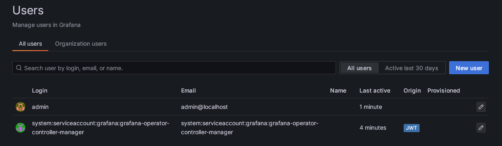

Among the auth mechanisms, `[auth.jwt]` stands out as it is uniquely compatible with Kubernetes!

Meaning, it is possible to use Kubernetes ServiceAccount tokens (JWTs) to authenticate to with Grafana.

From `v5.21.0`, the Grafana-Operator can authenticate to Grafana instances using the projected Kubernetes ServiceAccount JWT when `[auth.jwt]` is configured.

Enable JWT auth for a Grafana instance with `.spec.client.useKubeAuth=true` and configure Grafana to trust JWTs issued by Kubernetes:





`role_attribute_path` determines the assigned role by the claims in the JWT body:

The example assigns `Admin`, or `GrafanaAdmin` if `allow_assign_grafana_admin: "true"`, to any ServiceAccount in the `grafana` namespace.

But this may not be secure or flexible enough depending on your setup.

Inspecting a standard JWT located at `/var/run/secrets/kubernetes.io/serviceaccount/token` in a pod contains the following claims:



Which can be used to determine the given role with `role_attribute_path`


## Grafana versions prior to 12.2.0

Older versions of Grafana cannot authenticate with a JWKS endpoint, which is necessary to retrieve the `JWKSet` from Kubernetes.

Users instead need to mount in the `JWKSet` as a file from either a ConfigMap or Secret.

```bash
kubectl create configmap kube-root-jwks --from-literal=jwks.json="$(kubectl get --raw /openid/v1/jwks)"
```




# Issuing Tokens for ServiceAccounts

Tokens can be issued for a service account ad hoc with kubectl.

This could be used for testing or just an easy way to create short lived JWTs for a ServiceAccount with access to Grafana

```bash
# Create serviceaccount JWT and store it in ./token
kubectl create token -n grafana grafana-operator-controller-manager --duration  >token

# Expose a port
kubectl port-forward svc/jwt-grafana-ca-service 3000:3000 &>/dev/null &

# curl the instance using the token
curl 'http://127.0.0.1:3000/api/folders' -H "Authorization: Bearer $(cat token)"

# An array, even empty `[]`, is a successful response!
```


## Disabling the default GrafanaAdmin account

Before, if users wanted to disable the disable the default GrafanaAdmin account, it was necessary to manually create a Grafana Service/User Accounts before disabling it.

But that is no longer the case with `[auth.jwt]` and `.spec.client.useKubeAuth=true`.
