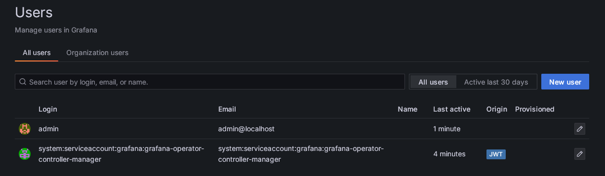

Since Grafana can be configured to accept JsonWebTokens (JWT), It's possible to use Kubernetes ServiceAccount tokens as an authentication mechanism!

Starting from `v5.21.0` the Grafana-Operator can authenticate to Grafana instances using the mounted Kubernetes ServiceAccount JWT token.

To use the ServiceAccount JWT, enable `.spec.useKubeAuth=true` and configure Grafana to trust JWTs issued by Kubernetes:





`role_attribute_path` determines the assigned role depending on the claims in the JWT:

The above example will assign `Admin`, `GrafanaAdmin` if `allow_assign_grafana_admin: "true"`, to any ServiceAccount in the `grafana` namespace.

But this may not be secure flexible enough depending on your use case.

Inspecting a JWT from `/var/run/secrets/kubernetes.io/serviceaccount/token` contains the following claims



Which can be used to determine the given role with `role_attribute_path`


## Grafana versions prior to 12.2.0

Older versions of Grafana cannot authenticate with a JWKS endpoint, which is necessary to retrieve the `JWKSet` from Kubernetes.

Users instead need to mount in the `JWKSet` as a file from either a ConfigMap or Secret.

```bash
kubectl create configmap kube-root-jwks --from-literal=jwks.json="$(kubectl get --raw /openid/v1/jwks)"
```




# Issuing Tokens for ServiceAccounts

Once JWT Auth is configured, it's possible to create any number of tokens for a given Kubernetes ServiceAccount.

```bash
# Create serviceaccount JWT and store it in ./token
kubectl create token -n grafana grafana-operator-controller-manager --duration  >token

# Expose a port
kubectl port-forward svc/jwt-grafana-ca-service 3000:3000 &>/dev/null &

# curl the instance using the token
curl 'http://127.0.0.1:3000/api/folders' -H "Authorization: Bearer $(cat token)"

# An array, even empty `[]`, is a successful response!
```


## Disabling the default GrafanaAdmin account

Previously it was necessary to manually create Grafana Service/User Accounts in order to then disable the main GrafanaAdmin login.

But `[auth.jwt]`, now allows declaratively disabling the default GrafanaAdmin account with `disable_initial_admin_creation: "true"` and using the Kubernetes ServiceAccount with the given role.
